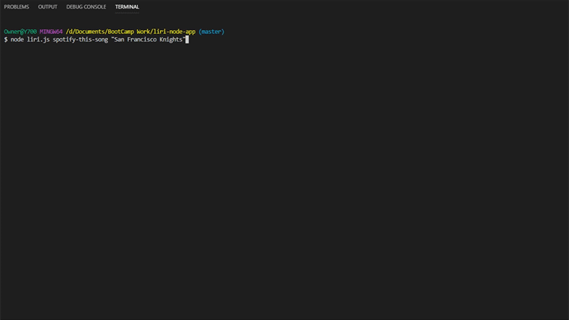
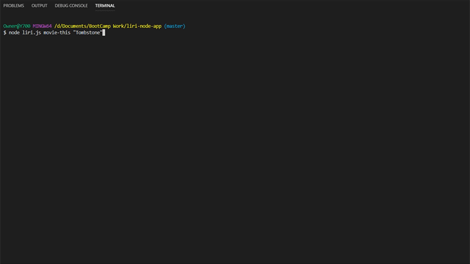
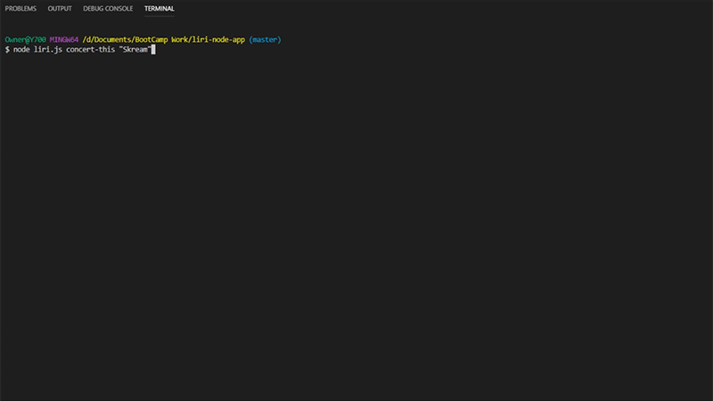
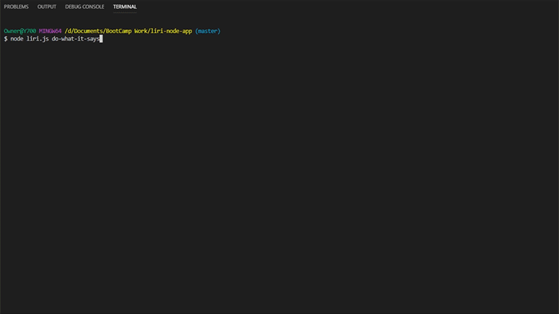

LIRI Node APP

Example of Spotify Lookup:




# Bands in Town API Lookup

```
Command: node liri.js concert-this "artist/band name here"
```

This will search the Bands in Town Artist Events API for an artist and render the following information about each event to the terminal:<br>

- Name of the venue
- Venue location
- Date of the Event (use moment to format this as "MM/DD/YYYY")

Exampe of Bands in Town API Lookup:


